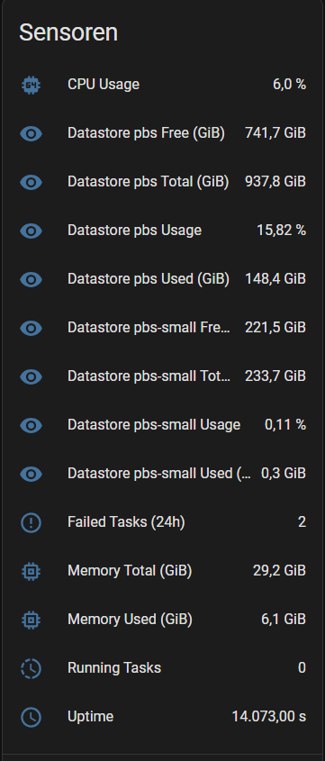
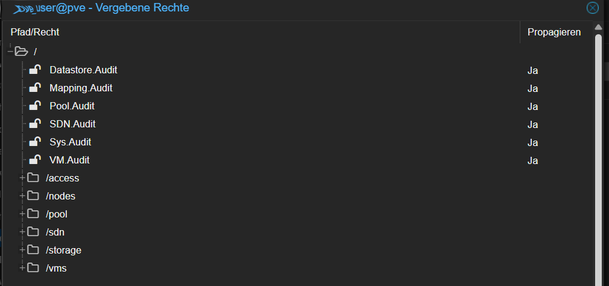
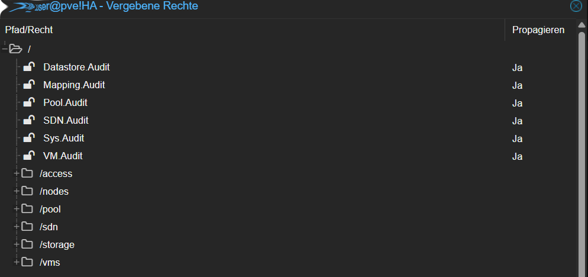

# Proxmox Suits (Home Assistant)

**Proxmox Suits** is a Home Assistant custom integration for monitoring  
**Proxmox VE (PVE)** and **Proxmox Backup Server (PBS)**.

It focuses on:
- clean sensors
- IEC units (GiB)
- task monitoring
- and a reliable Config Flow

---

## 🖥️ Dashboard Example (PBS)

Example Home Assistant dashboard using **Proxmox Suits**  
showing task status and datastore usage.

---

## 📊 Example Sensors (Home Assistant)

### Proxmox Backup Server (PBS)

### Proxmox VE (PVE)

---

## ✨ Features

### Proxmox VE
- CPU usage (%)
- Memory usage (%), used/total (GiB)
- Load (1m)
- Uptime
- VM & LXC counts (running / total)

### Proxmox Backup Server (PBS)
- CPU usage (%)
- Memory used / total (GiB)
- Uptime
- Datastores:
  - Free / Used / Total (GiB)
  - Usage (%)
- Tasks:
  - Running tasks (live, via `running=true`)
  - Failed tasks (last 24 hours)

---

## 📦 Installation (HACS)

1. Open **HACS**
2. Go to **Integrations**
3. Add a **Custom Repository**
   - URL: `https://github.com/Sundancer78/proxmox-suits`
   - Category: **Integration**
4. Install **Proxmox Suits**
5. Restart Home Assistant

---

## 🛠 Manual Installation

Copy the folder:

custom_components/proxmox_suite

into your Home Assistant config directory and restart Home Assistant.

---

## ⚙️ Configuration

Go to:

**Settings → Devices & Services → Add Integration → Proxmox Suits**

You will need:

- **Backend**: Proxmox VE or Proxmox Backup Server
- **Host**: IP or hostname
- **Port**
  - PVE: `8006`
  - PBS: `8007`
- **Token ID**
- **Token Secret**
- **Node**
  - Optional for PVE
  - Leave empty to auto-detect
- **Verify SSL**
  - Enable if you use valid certificates

---

## 🔐 Permissions (VERY IMPORTANT)

### ❗ Both the **User** AND the **API Token** must have permissions

Proxmox **does not automatically inherit user permissions to API tokens**.

You **must** assign the required permissions **twice**:
1. to the **user**
2. to the **API token**

If either is missing, the integration may show:
- HTTP 403 errors
- unavailable sensors
- missing task or datastore data

---

### ✅ Example: Required permissions (read-only monitoring)

At minimum, the following audit permissions are recommended:

- `Sys.Audit`
- `VM.Audit`
- `Datastore.Audit`
- `Pool.Audit`
- `Mapping.Audit`
- `SDN.Audit`

Applied at path:

/

With **propagation enabled**.

---

### 📸 Screenshots (Permissions)

#### User permissions

#### API token permissions

---

## 🧪 Troubleshooting

### ❌ HTTP 403 / Permission check failed
- Ensure **both user AND token** have permissions
- Check propagation is enabled
- Reload the integration after changes

### ❌ Running tasks always 0 on PBS
- PBS uses a filtered endpoint:

/nodes/<node>/tasks?running=true

- Running tasks may not include `status` or `state`
- The integration detects running tasks via missing `endtime`

### ❌ Node errors on PVE
- Leave the **Node** field empty
- The integration will auto-detect it

---

## 🧾 License

MIT License  
© 2026 Sundancer78
